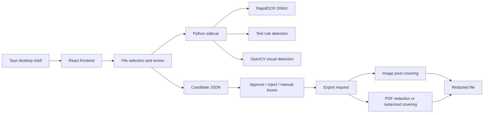

# PrivUnit

[中文](./README.md) | English

A cross-platform local desktop client for redacting PDF, JPG/JPEG, and PNG application materials. The project runs offline by default, generates candidate redaction boxes with OCR, text rules, and visual detection, then exports a new file with real redaction after human review.

This project is intended for materials that should not be uploaded to cloud services, such as identity documents, employer certificates, application forms, scanned pages, images/PDFs with official seals, and documents with ID portraits.

The current UI includes both Chinese and English text and can be switched directly in the desktop app.

## Table of Contents

- [Core Features](#core-features)
- [Use Cases](#use-cases)
- [Architecture](#architecture)
- [Workflow](#workflow)
- [Detection Scope](#detection-scope)
- [Project Structure](#project-structure)
- [Requirements](#requirements)
- [Local Development](#local-development)
- [Sidecar Commands](#sidecar-commands)
- [Desktop Packaging](#desktop-packaging)
- [Testing and Verification](#testing-and-verification)
- [Configuration and Assets](#configuration-and-assets)
- [Security and Compliance Notes](#security-and-compliance-notes)
- [FAQ](#faq)
- [Open Source Acknowledgements](#open-source-acknowledgements)
- [License](#license)

## Core Features

- **Local offline processing**: File analysis, candidate generation, and export all run on the local machine by default.
- **Multiple file formats**: Supports `pdf`, `jpg`, `jpeg`, and `png`, with `ipg` treated as a typo-compatible alias for `jpg`.
- **Upload validation**: Each file is limited to 4 MiB. Social-type materials must include at least one file.
- **Smart candidate generation**: Bundled RapidOCR ONNX models recognize text, then rule-based detection marks sensitive fields.
- **Visual detection**: OpenCV detects red official seal regions, faces/ID portraits, and logo-like blocks near the page header.
- **Chinese/English UI**: `src/i18n.ts` provides `zh-CN` and `en` text for UI labels, errors, buttons, and candidate categories.
- **Human review**: Candidates start as pending. Users can approve, delete, undo deletion, drag to draw boxes, or add a default manual box.
- **Stable preview ratio**: The preview uses the analyzed page dimensions as CSS `aspect-ratio`, so landscape PDFs/images are not forced into a portrait layout.
- **Real redaction export**: Images are covered at the pixel level. Digital PDFs use PyMuPDF redaction first to remove underlying text and cover affected image pixels.
- **Cross-platform desktop app**: Built with Tauri 2, React, and a Python sidecar, with packaging support for macOS, Windows, and Linux/domestic desktop systems.
- **Asset integrity checks**: OCR models include a `manifest.json`; runtime checks validate model file size and SHA-256.

## Use Cases

- Redact identity numbers, phone numbers, personal names, and similar fields before submitting application or proof materials.
- Hide employer names, departments, addresses, official seals, logos, and ID portraits after rule-based detection and manual review.
- Process sensitive materials in offline, intranet, or single-machine environments.
- Export real PDF or image files for downstream use, instead of only masking a preview layer.

## Architecture



The frontend handles user interaction, file lists, page previews, candidate review, and export actions. OCR, visual detection, PDF processing, and actual file export are handled by the Python sidecar. The desktop app calls `redactor-sidecar` through the Tauri shell plugin.

## Workflow

1. Select the material type: `social` or `other`.
2. Switch the UI language if needed: Chinese or English.
3. Enter the personal name and employer keywords to improve precise matching.
4. Add PDF/JPG/PNG files.
5. Generate candidates; the sidecar analyzes files locally and returns candidate boxes.
6. Review candidates in the preview, delete false positives, undo deletion, or add manual boxes by dragging/default box.
7. Export the active file; only approved boxes are applied.
8. Save the newly redacted file.

## Detection Scope

| Type | Category | Source | Description |
| --- | --- | --- | --- |
| Personal name | `person_name` | OCR + rules | Matches only the user-entered name to avoid over-redacting other names |
| Identity number | `identity_number` | OCR + regex | Detects mainland China identity number patterns |
| Phone number | `phone_number` | OCR + regex | Detects 11-digit numbers starting with `1[3-9]` |
| Employer name | `employer_name` | OCR + keywords | Matches user-provided terms and hints such as company, university, hospital, school |
| Employer address | `employer_address` | OCR + keywords | Matches address-related hints |
| Department name | `department_name` | OCR + keywords | Matches department, college, office, center, and similar hints |
| Official seal | `seal` | OpenCV | Detects red official seal regions and creates candidates |
| ID portrait / face | `portrait` | OpenCV | Detects face candidates with Haar cascade |
| Employer logo | `employer_logo` | OpenCV | Detects logo-like blocks in the page header region |
| Manual box | `manual` | User action | Covers missing regions that automatic detection did not catch |

Candidate boxes use normalized coordinates. The frontend preview and backend export share the same JSON shape, which keeps displayed boxes aligned with exported redaction regions.

## Project Structure

```text
.
├── src/                         # React frontend
│   ├── App.tsx                   # Main UI, review flow, and export entry
│   ├── i18n.ts                   # Chinese/English UI text and candidate labels
│   ├── services/sidecar.ts       # Tauri sidecar call wrapper
│   ├── utils/files.ts            # File extension and size validation
│   ├── utils/pageLayout.ts       # Preview ratio from real page dimensions
│   └── types.ts                  # Shared frontend/backend data types
├── sidecar/redactor/             # Python redaction analysis and export core
│   ├── cli.py                    # analyze/export/validate command entry
│   ├── analysis.py               # Image/PDF analysis pipeline
│   ├── detection.py              # Sensitive text detection
│   ├── vision.py                 # Seal, face, and logo visual detection
│   ├── ocr.py                    # RapidOCR integration
│   ├── ocr_models.py             # OCR model discovery and integrity checks
│   └── exporter.py               # Real image/PDF redaction export
├── resources/                    # Offline assets bundled into the desktop app
│   ├── ocr/rapidocr/             # RapidOCR ONNX models and manifest
│   └── vision/haarcascades/      # OpenCV face cascade
├── src-tauri/                    # Tauri 2 desktop project
├── scripts/                      # Sidecar, desktop packaging, and verification scripts
│   ├── build_desktop.sh          # macOS packaging entry
│   ├── build_desktop.ps1         # Windows packaging entry
│   └── build_desktop_linux.sh    # Linux .deb/.AppImage packaging entry
├── tests/                        # Python unit tests and packaging verification tests
├── docs/architecture.md          # Additional architecture notes
└── .github/workflows/            # macOS/Windows desktop CI build
```

## Requirements

- Node.js 22 or a compatible version
- npm
- Python 3.10+
- Rust stable and Cargo
- Tauri 2 system prerequisites
- A valid UTF-8 locale for macOS packaging, such as `en_US.UTF-8`
- Windows packaging must generate the platform-specific sidecar on Windows
- Linux packaging requires WebKitGTK, GTK3, AppIndicator, librsvg, and `patchelf`
- Linux runtime dependencies include `libwebkit2gtk-4.1-0`, `libgtk-3-0`, `libayatana-appindicator3-1`, and `librsvg2-2`

Python runtime dependencies:

- `numpy`
- `opencv-python`
- `pillow`
- `pymupdf`
- `onnxruntime`
- Optional OCR dependency: `rapidocr-onnxruntime`
- Development dependencies: `pytest`, `reportlab`

Main frontend and desktop dependencies:

- `@tauri-apps/api`
- `@tauri-apps/cli`
- `@tauri-apps/plugin-dialog`
- `@tauri-apps/plugin-fs`
- `@tauri-apps/plugin-shell`
- `react`
- `react-dom`
- `vite`
- `typescript`
- `vitest`
- `lucide-react`

## Local Development

Install frontend dependencies:

```bash
npm install
```

Install Python dependencies:

```bash
python3 -m pip install -e ".[dev,ocr]"
```

Run browser-only frontend development mode:

```bash
npm run dev
```

Browser mode has no Tauri sidecar. The frontend uses mock analysis data, which is useful for UI and interaction development.

Run Tauri desktop development mode:

```bash
npm run tauri -- dev
```

Desktop mode calls the sidecar through Tauri. Before the first run, make sure the sidecar for the current platform has been generated:

```bash
python3 -m pip install pyinstaller
python3 scripts/build_sidecar.py
```

Build frontend static assets:

```bash
npm run build
```

## Sidecar Commands

The sidecar can be run directly for debugging and automated verification.

Analyze a file:

```bash
PYTHONPATH=sidecar python3 -m redactor.cli analyze \
  --file /path/to/input.png \
  --file-id file-1 \
  --person-name ZhangSan \
  --employer-term ExampleUniversity \
  --material-type social
```

Validate a material submission:

```bash
PYTHONPATH=sidecar python3 -m redactor.cli validate-submission \
  --material-type social \
  --file /path/to/input.pdf
```

Export from a JSON request file:

```bash
PYTHONPATH=sidecar python3 -m redactor.cli export --request /path/to/export-request.json
```

Or pass the JSON payload directly:

```bash
PYTHONPATH=sidecar python3 -m redactor.cli export-json '{"sourcePath":"/path/to/input.png","outputPath":"/path/to/out.png","candidates":[]}'
```

Export request shape:

```json
{
  "sourcePath": "/path/to/input.pdf",
  "outputPath": "/path/to/output.pdf",
  "rasterizePdfPages": false,
  "candidates": [
    {
      "fileId": "file-1",
      "pageIndex": 0,
      "rectNormalized": {
        "x": 0.1,
        "y": 0.1,
        "width": 0.2,
        "height": 0.05
      },
      "category": "identity_number",
      "source": "ocr",
      "confidence": 0.98,
      "status": "approved",
      "color": "#2563eb",
      "text": "110105199001011234"
    }
  ]
}
```

Only candidates with `status` set to `approved` are actually covered during export.

## Desktop Packaging

### macOS

```bash
./scripts/build_desktop.sh
```

The script runs `scripts/build_sidecar.py` first to create the Tauri `externalBin` sidecar, then runs Tauri build. On macOS, if the DMG step fails because of Finder AppleScript or locale issues, the script attempts a fallback DMG build and verifies the result.

Example macOS Apple Silicon sidecar name:

```text
src-tauri/binaries/redactor-sidecar-aarch64-apple-darwin
```

Example macOS Apple Silicon desktop artifacts:

```text
src-tauri/target/release/bundle/macos/私元处理.app
src-tauri/target/release/bundle/dmg/私元处理_0.1.0_aarch64.dmg
```

### Windows

```powershell
.\scripts\build_desktop.ps1
```

Windows generates a sidecar similar to:

```text
src-tauri/binaries/redactor-sidecar-x86_64-pc-windows-msvc.exe
```

### Linux / Domestic Desktop Systems

```bash
./scripts/build_desktop_linux.sh
```

The script must run on Linux. It generates the current-platform sidecar first, then runs:

```bash
npm run tauri -- build --bundles deb,appimage
```

The outputs include `.deb` and `.AppImage`. On Ubuntu Desktop, Kylin, UOS, and other Debian/Ubuntu-family desktop systems, prefer `.deb`; use `.AppImage` as a fallback when system dependencies do not match or cannot be installed.

Example Linux sidecar names:

```text
src-tauri/binaries/redactor-sidecar-x86_64-unknown-linux-gnu
src-tauri/binaries/redactor-sidecar-aarch64-unknown-linux-gnu
```

Example Debian/Ubuntu build dependencies:

```bash
sudo apt-get update
sudo apt-get install -y \
  libwebkit2gtk-4.1-dev \
  libgtk-3-dev \
  libayatana-appindicator3-dev \
  librsvg2-dev \
  patchelf
```

### CI Build

The repository includes `.github/workflows/build-desktop.yml`. The current matrix covers:

- `macos-15`: macOS arm64 desktop build
- `windows-latest`: Windows x64 desktop build
- `ubuntu-24.04`: Linux x64 `.deb` / `.AppImage` build

CI runs:

```bash
python -m pytest -q
npm run test:ui
npm run build
python scripts/build_sidecar.py
python scripts/verify_sidecar.py --sidecar "$SIDECAR"
npm run tauri -- build
```

Linux CI additionally installs desktop dependencies, calls `./scripts/build_desktop_linux.sh`, and verifies that both `.deb` and `.AppImage` outputs exist.

Build outputs are uploaded as GitHub Actions artifacts.

## Testing and Verification

Run Python tests:

```bash
python3 -m pytest
```

Run frontend tests:

```bash
npm run test:ui
```

Run frontend build verification:

```bash
npm run build
```

Verify that the sidecar can use bundled models and detect an identity number:

```bash
python3 scripts/verify_sidecar.py --sidecar src-tauri/binaries/redactor-sidecar-aarch64-apple-darwin
```

Verify that a macOS `.app` bundle contains the required assets and passes a real sidecar smoke test:

```bash
python3 scripts/verify_bundle.py \
  --app "src-tauri/target/release/bundle/macos/私元处理.app" \
  --smoke-image /path/to/identity-smoke.png
```

Recommended release checks:

- File extension and 4 MiB limits are enforced.
- Social-type materials cannot be analyzed without an uploaded file.
- Missing OCR models produce a clear error instead of silently skipping recognition.
- Identity number, phone number, personal name, and employer keywords can produce candidates.
- Personal names inside longer OCR lines are narrowed to the matched substring region where possible.
- Red official seal regions produce `seal` candidates.
- Landscape scanned PDFs/images keep their real preview and export aspect ratio.
- Drag-drawn manual boxes and default manual boxes are accepted by the export pipeline.
- Deleted candidates can be restored through undo.
- Chinese/English UI text, candidate labels, and localized errors switch correctly.
- Exported images have real pixel coverage in the target regions.
- Exported PDFs remove underlying text through redaction, and scanned pages do not retain sensitive pixels.
- macOS/Windows/Linux sidecar filenames follow Tauri `externalBin` rules.

## Configuration and Assets

Tauri configuration is in `src-tauri/tauri.conf.json`:

- Product name: `私元处理`
- App identifier: `cn.privunit.desktop`
- Default window: `1280x820`
- Minimum window: `980x680`
- Frontend output: `../dist`
- Sidecar: `binaries/redactor-sidecar`
- Bundled resources: `../sidecar`, `../resources`
- Linux deb dependencies: WebKitGTK, GTK3, AppIndicator, librsvg

OCR model assets are located at:

```text
resources/ocr/rapidocr/models/
```

Required files:

```text
ch_PP-OCRv3_det_infer.onnx
ch_ppocr_mobile_v2.0_cls_infer.onnx
ch_PP-OCRv3_rec_infer.onnx
```

The `manifest.json` in the model directory verifies file size and SHA-256 to detect missing or corrupted models.

Visual detection assets are located at:

```text
resources/vision/haarcascades/haarcascade_frontalface_default.xml
```

The sidecar prefers the bundled cascade model and falls back to OpenCV's built-in resource if it is missing.

## Security and Compliance Notes

- The project processes files locally by default and does not implement any upload service.
- Redaction only applies to user-approved candidate boxes; automatic results must be manually reviewed.
- Digital PDFs use PyMuPDF redaction by default to remove underlying text and cover affected image pixels.
- For scanned PDFs or complex image-backed PDFs, use rasterized export to improve visible pixel coverage certainty.
- White redaction color is rejected to avoid visual masking that blends into the background.
- Automatic detection cannot guarantee 100% coverage of all sensitive content. Manual review is required before publication or submission.
- PyMuPDF is distributed under AGPL/commercial dual licensing. For closed-source commercial distribution, purchase a commercial license or adjust the PDF export strategy to satisfy license requirements.

## FAQ

### Why is real detection unavailable in browser development mode?

`npm run dev` starts only the Vite frontend and cannot call the Tauri sidecar. This mode returns mock candidates and is intended for UI development. Use the desktop mode for real detection:

```bash
npm run tauri -- dev
```

### What should I do if OCR models cannot be found?

Make sure this directory exists and contains the three ONNX models:

```text
resources/ocr/rapidocr/models/
```

You can also set the resource directory explicitly:

```bash
LOCAL_REDACTOR_RESOURCE_DIR=/path/to/project PYTHONPATH=sidecar python3 -m redactor.cli analyze --file /path/to/input.png --file-id file-1
```

### Why were only some candidate boxes exported?

The export pipeline only covers candidates with `approved` status. Pending or rejected candidates are ignored.

### Can deleted candidates be restored?

Yes. The candidate panel provides an undo button. Recently deleted candidates are kept in an undo stack, with up to the latest 20 deletion records retained. When a file is removed, its related undo records are also cleared.

### Why was a personal name not detected?

Personal-name detection only matches the name entered by the user. It does not try to detect every Chinese name, which reduces false positives. If the name appears inside a longer OCR line, the system estimates the substring position and tries to box only the matched name.

### Should PDF export use structured redaction or rasterization?

Digital PDFs should prefer structured redaction because it can remove underlying text while preserving a better PDF structure. Scanned PDFs, image-only PDFs, or complex source PDFs should use rasterized export for stronger visible-pixel coverage.

### Why can landscape scans keep a landscape preview?

The analysis result returns the width and height of every page. The frontend uses `pageAspectRatio()` to set the preview container ratio. Before analysis, it falls back to a default A4 portrait ratio; after analysis, it displays the real page dimensions.

### Does the English UI affect detection results?

No. Language switching only changes UI text, error messages, and candidate labels. The sidecar detection logic still uses file content, the entered personal name, and employer keywords.

## Open Source Acknowledgements

This project is built on excellent open source projects. Thanks to the following projects for desktop runtime, frontend tooling, OCR, image processing, PDF processing, testing, and automation capabilities:

- [Tauri](https://tauri.app/): Cross-platform desktop application framework used for the local shell and sidecar invocation.
- [React](https://react.dev/): Frontend UI framework for the file list, preview, candidate review, and export interface.
- [Vite](https://vite.dev/): Frontend development server and build tool.
- [TypeScript](https://www.typescriptlang.org/): Type system for the frontend.
- [lucide-react](https://lucide.dev/): Icon library for the interface.
- [RapidOCR](https://github.com/RapidAI/RapidOCR): OCR solution used here through ONNX Runtime models.
- [ONNX Runtime](https://onnxruntime.ai/): Runtime for ONNX model inference.
- [OpenCV](https://opencv.org/): Image processing and visual detection for seals, faces, and logo candidates.
- [PyMuPDF](https://pymupdf.readthedocs.io/): PDF parsing, rendering, and redaction export.
- [Pillow](https://python-pillow.org/): Image reading, drawing, and export.
- [NumPy](https://numpy.org/): Array computation foundation for image processing.
- [PyInstaller](https://pyinstaller.org/): Single-file packaging for the Python sidecar.
- [pytest](https://pytest.org/): Python testing framework.
- [Vitest](https://vitest.dev/): Frontend testing framework.
- [GitHub Actions](https://github.com/features/actions): Automated macOS/Windows desktop builds.

Please review the licenses of all dependencies and model files before redistribution, especially PyMuPDF's AGPL/commercial dual-license requirements.

## License

This project is open sourced under the [GNU Affero General Public License v3.0 only](./LICENSE) (`AGPL-3.0-only`).

You may use, copy, modify, and distribute this project under the terms of AGPL-3.0. This includes source-code availability, license preservation, and source-code offering obligations for network interaction scenarios. Before redistribution, review the licensing scope of all third-party dependencies and model files.
