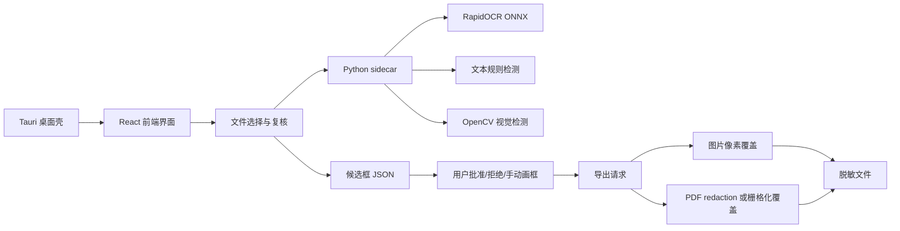

# 私元处理

中文 | [English](./README.en.md)

面向 PDF、JPG/JPEG、PNG 申报材料的跨平台本地脱敏桌面客户端。项目默认离线运行，通过 OCR、文本规则和视觉规则生成候选脱敏框，用户复核后导出真正覆盖敏感内容的新文件。

本项目适合处理不便上传到云端的材料，例如身份证明、单位证明、申请表、扫描件、含公章或证件照的图片/PDF 等。当前界面内置中文和英文两套文案，可在桌面端直接切换。

## 目录

- [核心特性](#核心特性)
- [适用场景](#适用场景)
- [系统架构](#系统架构)
- [处理流程](#处理流程)
- [识别范围](#识别范围)
- [目录结构](#目录结构)
- [环境要求](#环境要求)
- [本地开发](#本地开发)
- [Sidecar 命令](#sidecar-命令)
- [桌面端打包](#桌面端打包)
- [测试与验收](#测试与验收)
- [配置与资源](#配置与资源)
- [安全与合规说明](#安全与合规说明)
- [常见问题](#常见问题)
- [开源致谢](#开源致谢)
- [许可证](#许可证)

## 核心特性

- **本地离线处理**：材料分析、候选框生成和导出均在本机完成，默认不依赖远端服务。
- **多格式支持**：支持 `pdf`、`jpg`、`jpeg`、`png`，并兼容用户误输入的 `ipg` 扩展名。
- **上传约束**：单文件大小限制为 4 MiB；社会化类型材料必须上传待脱敏文件。
- **智能候选框**：内置 RapidOCR ONNX 模型识别文字，结合规则识别敏感字段。
- **视觉检测**：使用 OpenCV 检测红色公章、人脸/证件照、页眉区域疑似 Logo。
- **中英文界面**：前端通过 `src/i18n.ts` 提供 `zh-CN` 和 `en` 文案，错误提示、按钮和候选分类同步切换。
- **人工复核**：候选框默认待确认，用户可批准、删除、撤销删除，也可拖拽或添加默认框补充遗漏区域。
- **稳定预览比例**：预览区根据分析页宽高设置真实 `aspect-ratio`，横向 PDF/图片不会被强行压成竖版。
- **真实脱敏导出**：图片按像素覆盖；数字 PDF 优先使用 PyMuPDF redaction 删除底层文本并覆盖图片像素。
- **跨平台桌面端**：基于 Tauri 2 + React + Python sidecar，可在 macOS、Windows、Linux/国产桌面系统打包分发。
- **资源完整性校验**：OCR 模型包含 `manifest.json`，运行时校验模型文件大小和 SHA-256。

## 适用场景

- 申报材料、证明材料在提交前需要遮盖身份证号、手机号、本人姓名等信息。
- 单位名称、部门、地址、公章、Logo、证件照等需要按规则或人工复核后隐藏。
- 数据不能上传第三方服务，希望在内网或单机环境完成脱敏。
- 需要导出可直接流转的新 PDF 或图片文件，而不是只在预览层遮挡。

## 系统架构



前端负责用户交互、文件列表、页面预览、候选框复核和导出入口。真正的 OCR、视觉识别、PDF 处理与文件导出由 Python sidecar 完成，桌面端通过 Tauri shell plugin 调用 `redactor-sidecar`。

## 处理流程

1. 选择材料类型：`社会化类型` 或 `其他类型`。
2. 按需切换界面语言：中文或英文。
3. 填写本人姓名和单位关键词，作为精准匹配辅助信息。
4. 添加 PDF/JPG/PNG 文件。
5. 点击生成候选，sidecar 本地分析文件并返回候选框。
6. 在预览页逐项确认、删除、撤销删除，或通过拖拽/默认框补充手动区域。
7. 点击导出当前文件，sidecar 只对已批准区域执行真实覆盖。
8. 保存脱敏后的新文件。

## 识别范围

| 类型 | 分类值 | 来源 | 说明 |
| --- | --- | --- | --- |
| 本人姓名 | `person_name` | OCR + 规则 | 仅匹配用户输入的本人姓名，避免误伤其他姓名 |
| 身份证号 | `identity_number` | OCR + 正则 | 识别中国大陆身份证号格式 |
| 手机号码 | `phone_number` | OCR + 正则 | 识别 `1[3-9]` 开头的 11 位手机号 |
| 单位名称 | `employer_name` | OCR + 关键词 | 匹配用户输入关键词，以及公司、大学、医院、学校等提示词 |
| 单位地址 | `employer_address` | OCR + 关键词 | 匹配地址、住址、所在地、通讯地址、注册地址等提示词 |
| 部门名称 | `department_name` | OCR + 关键词 | 匹配部门、学院、科室、中心、办公室等提示词 |
| 公章 | `seal` | OpenCV | 检测红色公章区域并生成候选框 |
| 证件照/人脸 | `portrait` | OpenCV | 基于 Haar cascade 检测人脸候选 |
| 单位 Logo | `employer_logo` | OpenCV | 检测页眉区域疑似 Logo 块 |
| 手动画框 | `manual` | 用户操作 | 用于补充自动识别遗漏区域 |

候选框坐标统一使用归一化坐标，前端渲染和后端导出共用同一份 JSON，避免预览和导出区域不一致。

## 目录结构

```text
.
├── src/                         # React 前端界面
│   ├── App.tsx                   # 主界面、复核流程和导出入口
│   ├── i18n.ts                   # 中文/英文界面文案和候选分类标签
│   ├── services/sidecar.ts       # Tauri sidecar 调用封装
│   ├── utils/files.ts            # 文件格式和大小校验
│   ├── utils/pageLayout.ts       # 根据真实页面尺寸计算预览比例
│   └── types.ts                  # 前后端共享数据结构
├── sidecar/redactor/             # Python 脱敏分析与导出核心
│   ├── cli.py                    # analyze/export/validate 命令入口
│   ├── analysis.py               # 图片/PDF 分析流程
│   ├── detection.py              # 文本敏感信息检测
│   ├── vision.py                 # 公章、人脸、Logo 视觉检测
│   ├── ocr.py                    # RapidOCR 调用
│   ├── ocr_models.py             # OCR 模型查找与完整性校验
│   └── exporter.py               # 图片/PDF 真实脱敏导出
├── resources/                    # 打包进桌面端的离线资源
│   ├── ocr/rapidocr/             # RapidOCR ONNX 模型与 manifest
│   └── vision/haarcascades/      # OpenCV 人脸级联模型
├── src-tauri/                    # Tauri 2 桌面端工程
├── scripts/                      # sidecar、桌面端构建和验收脚本
│   ├── build_desktop.sh          # macOS 打包入口
│   ├── build_desktop.ps1         # Windows 打包入口
│   └── build_desktop_linux.sh    # Linux .deb/.AppImage 打包入口
├── tests/                        # Python 单元测试与打包验证测试
├── docs/architecture.md          # 架构补充说明
└── .github/workflows/            # macOS/Windows 桌面端 CI 构建
```

## 环境要求

- Node.js 22 或兼容版本
- npm
- Python 3.10+
- Rust stable 与 Cargo
- Tauri 2 所需系统依赖
- macOS 打包建议设置可用 UTF-8 locale，例如 `en_US.UTF-8`
- Windows 打包需要在 Windows 环境生成对应平台的 sidecar
- Linux 打包需要 WebKitGTK、GTK3、AppIndicator、librsvg 和 `patchelf`
- Linux 运行依赖示例：`libwebkit2gtk-4.1-0`、`libgtk-3-0`、`libayatana-appindicator3-1`、`librsvg2-2`

Python 运行依赖：

- `numpy`
- `opencv-python`
- `pillow`
- `pymupdf`
- `onnxruntime`
- 可选 OCR 依赖：`rapidocr-onnxruntime`
- 开发依赖：`pytest`、`reportlab`

前端与桌面端主要依赖：

- `@tauri-apps/api`
- `@tauri-apps/cli`
- `@tauri-apps/plugin-dialog`
- `@tauri-apps/plugin-fs`
- `@tauri-apps/plugin-shell`
- `react`
- `react-dom`
- `vite`
- `typescript`
- `vitest`
- `lucide-react`

## 本地开发

安装前端依赖：

```bash
npm install
```

安装 Python 依赖：

```bash
python3 -m pip install -e ".[dev,ocr]"
```

运行前端浏览器开发模式：

```bash
npm run dev
```

浏览器模式下没有 Tauri sidecar，前端会使用 mock 分析结果，适合调 UI 和交互。

运行 Tauri 桌面开发模式：

```bash
npm run tauri -- dev
```

桌面模式会通过 Tauri 调用 sidecar。首次运行前请确保已经生成当前平台的 sidecar：

```bash
python3 -m pip install pyinstaller
python3 scripts/build_sidecar.py
```

构建前端静态资源：

```bash
npm run build
```

## Sidecar 命令

sidecar 支持独立命令，便于调试和自动化验证。

分析文件：

```bash
PYTHONPATH=sidecar python3 -m redactor.cli analyze \
  --file /path/to/input.png \
  --file-id file-1 \
  --person-name 张三 \
  --employer-term 某某大学 \
  --material-type social
```

校验提交材料：

```bash
PYTHONPATH=sidecar python3 -m redactor.cli validate-submission \
  --material-type social \
  --file /path/to/input.pdf
```

使用 JSON 请求导出：

```bash
PYTHONPATH=sidecar python3 -m redactor.cli export --request /path/to/export-request.json
```

也可以直接传入 JSON 字符串：

```bash
PYTHONPATH=sidecar python3 -m redactor.cli export-json '{"sourcePath":"/path/to/input.png","outputPath":"/path/to/out.png","candidates":[]}'
```

导出请求字段：

```json
{
  "sourcePath": "/path/to/input.pdf",
  "outputPath": "/path/to/output.pdf",
  "rasterizePdfPages": false,
  "candidates": [
    {
      "fileId": "file-1",
      "pageIndex": 0,
      "rectNormalized": {
        "x": 0.1,
        "y": 0.1,
        "width": 0.2,
        "height": 0.05
      },
      "category": "identity_number",
      "source": "ocr",
      "confidence": 0.98,
      "status": "approved",
      "color": "#2563eb",
      "text": "110105199001011234"
    }
  ]
}
```

只有 `status` 为 `approved` 的候选框会被导出流程真正覆盖。

## 桌面端打包

### macOS

```bash
./scripts/build_desktop.sh
```

脚本会先执行 `scripts/build_sidecar.py` 生成 Tauri externalBin 所需的 sidecar，再执行 Tauri build。macOS 下如果 DMG 阶段因为 Finder AppleScript 或 locale 失败，脚本会尝试使用 fallback 方式重新生成并校验 DMG。

当前 macOS Apple Silicon sidecar 命名示例：

```text
src-tauri/binaries/redactor-sidecar-aarch64-apple-darwin
```

当前 macOS Apple Silicon 客户端产物示例：

```text
src-tauri/target/release/bundle/macos/私元处理.app
src-tauri/target/release/bundle/dmg/私元处理_0.1.0_aarch64.dmg
```

### Windows

```powershell
.\scripts\build_desktop.ps1
```

Windows 平台会生成类似下面的 sidecar：

```text
src-tauri/binaries/redactor-sidecar-x86_64-pc-windows-msvc.exe
```

### Linux / 国产桌面系统

```bash
./scripts/build_desktop_linux.sh
```

脚本必须在 Linux 上运行，会先生成当前平台 sidecar，再执行：

```bash
npm run tauri -- build --bundles deb,appimage
```

产物包括 `.deb` 和 `.AppImage`。Ubuntu 桌面版、银河麒麟、统信 UOS 等 Debian/Ubuntu 系桌面环境优先使用 `.deb`；系统依赖不匹配或无法安装依赖时，可使用 `.AppImage` 兜底。

Linux sidecar 命名示例：

```text
src-tauri/binaries/redactor-sidecar-x86_64-unknown-linux-gnu
src-tauri/binaries/redactor-sidecar-aarch64-unknown-linux-gnu
```

Debian/Ubuntu 系构建依赖示例：

```bash
sudo apt-get update
sudo apt-get install -y \
  libwebkit2gtk-4.1-dev \
  libgtk-3-dev \
  libayatana-appindicator3-dev \
  librsvg2-dev \
  patchelf
```

### CI 构建

仓库包含 `.github/workflows/build-desktop.yml`，当前矩阵覆盖：

- `macos-15`：macOS arm64 桌面端构建
- `windows-latest`：Windows x64 桌面端构建
- `ubuntu-24.04`：Linux x64 `.deb` / `.AppImage` 构建

CI 会执行：

```bash
python -m pytest -q
npm run test:ui
npm run build
python scripts/build_sidecar.py
python scripts/verify_sidecar.py --sidecar "$SIDECAR"
npm run tauri -- build
```

Linux CI 会额外安装桌面依赖，调用 `./scripts/build_desktop_linux.sh`，并校验 `.deb` 与 `.AppImage` 均已生成。

构建产物会上传为 GitHub Actions artifact。

## 测试与验收

运行 Python 测试：

```bash
python3 -m pytest
```

运行前端测试：

```bash
npm run test:ui
```

运行前端构建校验：

```bash
npm run build
```

验证 sidecar 能使用内置模型识别身份证候选：

```bash
python3 scripts/verify_sidecar.py --sidecar src-tauri/binaries/redactor-sidecar-aarch64-apple-darwin
```

验证 macOS `.app` 是否包含必要资源，并通过真实 sidecar smoke：

```bash
python3 scripts/verify_bundle.py \
  --app "src-tauri/target/release/bundle/macos/私元处理.app" \
  --smoke-image /path/to/identity-smoke.png
```

建议发布前至少完成以下检查：

- 文件格式与 4 MiB 限制生效。
- 社会化类型未上传文件时会阻止分析。
- OCR 模型缺失时会明确报错，而不是静默跳过识别。
- 身份证号、手机号、本人姓名、单位关键词可生成候选框。
- 本人姓名位于较长 OCR 行内时，候选框会尽量收缩到匹配姓名位置。
- 公章红色区域会生成 `seal` 候选。
- 横向扫描 PDF/图片预览和导出保持真实页面比例。
- 手动画框和默认框可被导出流程识别。
- 候选删除后可通过撤销恢复。
- 中英文界面文案、候选分类、错误提示可正常切换。
- 图片导出后目标区域像素已真实覆盖。
- PDF 导出后底层文本被 redaction 删除，扫描页不存在敏感底图残留。
- macOS/Windows/Linux 各自平台的 sidecar 文件名符合 Tauri externalBin 规则。

## 配置与资源

Tauri 配置位于 `src-tauri/tauri.conf.json`：

- 产品名：`私元处理`
- 应用标识：`cn.privunit.desktop`
- 默认窗口：`1280x820`
- 最小窗口：`980x680`
- 前端构建产物：`../dist`
- sidecar：`binaries/redactor-sidecar`
- 打包资源：`../sidecar`、`../resources`
- Linux deb 依赖：WebKitGTK、GTK3、AppIndicator、librsvg

OCR 模型资源位于：

```text
resources/ocr/rapidocr/models/
```

必须包含：

```text
ch_PP-OCRv3_det_infer.onnx
ch_ppocr_mobile_v2.0_cls_infer.onnx
ch_PP-OCRv3_rec_infer.onnx
```

模型目录中的 `manifest.json` 会用于校验文件大小和 SHA-256，防止模型缺失或损坏。

视觉检测资源位于：

```text
resources/vision/haarcascades/haarcascade_frontalface_default.xml
```

sidecar 会优先使用打包资源中的级联模型，缺失时尝试回退到 OpenCV 自带资源。

## 安全与合规说明

- 本项目默认在本地处理文件，未设计任何上传服务。
- 脱敏结果只覆盖用户批准的候选框，自动识别结果必须经过人工复核。
- PDF 数字页默认使用 PyMuPDF redaction，目标是删除底层文本并覆盖关联图片像素。
- 扫描 PDF 或复杂底图建议使用栅格化导出策略，避免隐藏图层或底图残留。
- 不允许使用白色作为脱敏颜色，避免视觉上看似遮盖但容易与背景混淆。
- 自动识别无法保证 100% 覆盖所有敏感内容，发布或提交前应人工抽检。
- PyMuPDF 采用 AGPL/商业双许可。若闭源商业分发，请购买商业授权，或调整 PDF 导出方案，避免不符合许可证要求。

## 常见问题

### 浏览器开发模式为什么没有真实识别？

`npm run dev` 只启动 Vite 前端，无法调用 Tauri sidecar。此模式会返回 mock 候选框，适合 UI 开发。需要真实识别时请使用：

```bash
npm run tauri -- dev
```

### 提示找不到 OCR 模型怎么办？

确认以下目录存在并包含三个 ONNX 模型：

```text
resources/ocr/rapidocr/models/
```

也可以设置资源目录环境变量辅助定位：

```bash
LOCAL_REDACTOR_RESOURCE_DIR=/path/to/project PYTHONPATH=sidecar python3 -m redactor.cli analyze --file /path/to/input.png --file-id file-1
```

### 为什么只导出了部分候选框？

导出流程只处理 `approved` 状态候选框。待确认或已拒绝的候选框不会被覆盖。

### 删除候选框后还能恢复吗？

可以。候选面板提供撤销按钮，最近删除的候选框会进入撤销栈，最多保留最近 20 条删除记录。删除文件时，该文件相关撤销记录也会被清理。

### 为什么本人姓名没有被识别？

本人姓名只匹配用户输入的姓名，不会泛化匹配所有中文姓名。这是为了减少误伤其他人员姓名。若姓名出现在较长 OCR 行内，系统会按字符位置估算姓名子区域，尽量只框住匹配姓名。

### PDF 导出应该选择结构化 redaction 还是栅格化？

数字 PDF 优先使用结构化 redaction，便于删除底层文本并保持较好的文件结构。扫描 PDF、图片型 PDF 或来源复杂的 PDF，建议使用栅格化导出策略提高可见像素覆盖确定性。

### 横向扫描件为什么能保持横向预览？

分析结果会返回每页宽高，前端通过 `pageAspectRatio()` 设置预览容器比例。没有分析结果时使用默认 A4 竖版比例；分析完成后按真实页面尺寸显示。

### 英文界面是否影响识别结果？

不会。语言切换只影响界面文案、错误提示和候选分类标签。sidecar 的检测逻辑仍按文件内容、姓名输入和单位关键词执行。

## 开源致谢

本项目基于多个优秀开源方案构建。感谢这些项目提供桌面端框架、前端工程、OCR、图像处理、PDF 处理、测试和自动化能力：

- [Tauri](https://tauri.app/)：跨平台桌面应用框架，用于承载本地桌面壳和 sidecar 调用。
- [React](https://react.dev/)：前端 UI 框架，用于构建材料列表、预览、候选框复核和导出界面。
- [Vite](https://vite.dev/)：前端开发服务器与构建工具。
- [TypeScript](https://www.typescriptlang.org/)：前端类型系统。
- [lucide-react](https://lucide.dev/)：界面图标库。
- [RapidOCR](https://github.com/RapidAI/RapidOCR)：OCR 方案，本项目通过 ONNX Runtime 形态加载中文 OCR 模型。
- [ONNX Runtime](https://onnxruntime.ai/)：ONNX 模型推理运行时。
- [OpenCV](https://opencv.org/)：图像处理与视觉检测能力，用于公章、人脸和 Logo 候选检测。
- [PyMuPDF](https://pymupdf.readthedocs.io/)：PDF 解析、渲染和 redaction 导出能力。
- [Pillow](https://python-pillow.org/)：图片读取、绘制和导出能力。
- [NumPy](https://numpy.org/)：图像处理中的数组计算基础能力。
- [PyInstaller](https://pyinstaller.org/)：Python sidecar 单文件打包。
- [pytest](https://pytest.org/)：Python 测试框架。
- [Vitest](https://vitest.dev/)：前端测试框架。
- [GitHub Actions](https://github.com/features/actions)：macOS/Windows 桌面端自动化构建。

请在二次分发时逐项确认上述依赖的许可证要求，尤其是 PyMuPDF 的 AGPL/商业双许可约束。

## 许可证

本项目采用 [GNU Affero General Public License v3.0 only](./LICENSE)（`AGPL-3.0-only`）开源。

这意味着你可以使用、复制、修改和分发本项目，但需要遵守 AGPL-3.0 的源代码开放、许可证保留和网络交互场景下的源代码提供义务。正式二次分发前，请同步审查所有第三方依赖和模型文件的授权范围。
